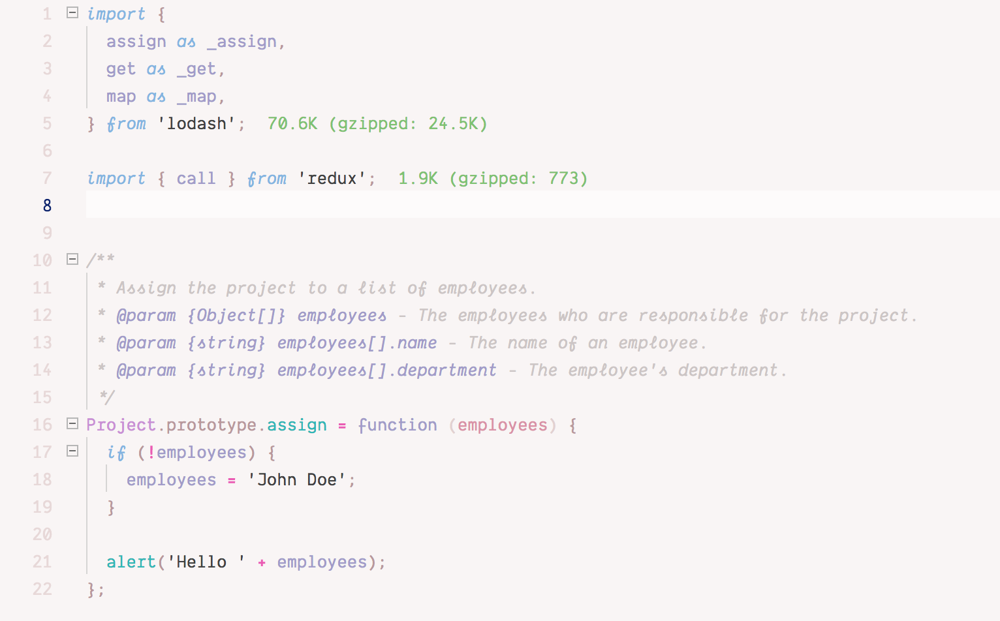

# \~ soft era \~

### syntax theme for [VS Code](https://code.visualstudio.com/)

🌸 Light pastel syntax theme for soft, warm, cozy, cute coding. 🌱


\~.\~
<br>&nbsp;&nbsp;a soft, warm, low contrast theme,
<br>&nbsp;&nbsp;with pastel accents that are easy on your eyes

^.^
<br>&nbsp;&nbsp;make stuff and learn.
<br>&nbsp;&nbsp;make the world your kinda place.
<br>&nbsp;&nbsp;take care of the people around you

🌿

## Installation

- Click **Install** on the [VS Code marketplace page for **soft era**](https://marketplace.visualstudio.com/items?itemName=soft-aesthetic.soft-era-theme)

&nbsp;&nbsp;&nbsp;&nbsp;&nbsp;&nbsp;**or**

- In the VS Code application, go to **Extensions**
  - (the square icon on the sidebar, or **View > Extensions**)
- Search for `soft era`
- Click the **Install** button

&nbsp;&nbsp;&nbsp;&nbsp;&nbsp;&nbsp;**👉THEN,**

- After installing this theme, click the blue **Reload** button (or quit and re-launch the editor).
- Go to **Preferences > Color Theme**
- Select `soft era` from the list of installed themes

### Enabling Italics

Preview:



- To configure VS Code to support italic styles add the code below to your config file in your workspace settings.
  - On Windows/Linux - **File > Preferences > Settings**
  - On macOS - **Code > Preferences > Settings**

```json
"editor.tokenColorCustomizations": {
  "textMateRules": [
    {
      "name": "Comment",
      "scope": [
        "comment",
        "punctuation.definition.comment"
      ],
      "settings": {
        "fontStyle": "italic",
      }
    },
    {
      "name": "Keyword, Storage",
      "scope": [
        "Keyword",
        "Storage"
      ],
      "settings": {
        "fontStyle": "italic"
      }
    },
    {
      "name": "Keyword Control",
      "scope": [
        "keyword.control"
      ],
      "settings": {
        "fontStyle": "italic"
      }
    },
    {
      "scope": "entity.other.attribute-name",
      "settings": {
        "fontStyle": "italic",
      }
    },
    {
      "name": "entity.name.method.js",
      "scope": [
        "entity.name.method.js"
      ],
      "settings": {
        "fontStyle": "italic",
      }
    },
    {
      "name": "Language methods",
      "scope": [
        "variable.language"
      ],
      "settings": {
        "fontStyle": "italic",
      }
    },
    {
      "name": "HTML Attributes",
      "scope": [
        "text.html.basic entity.other.attribute-name.html",
        "text.html.basic entity.other.attribute-name"
      ],
      "settings": {
        "fontStyle": "italic",
      }
    },
    {
      "name": "Decorators",
      "scope": [
        "tag.decorator.js entity.name.tag.js",
        "tag.decorator.js punctuation.definition.tag.js"
      ],
      "settings": {
        "fontStyle": "italic",
      }
    },
    {
      "name": "ES7 Bind Operator",
      "scope": [
        "source.js constant.other.object.key.js string.unquoted.label.js"
      ],
      "settings": {
        "fontStyle": "italic",
      }
    },
    {
      "name": "Markup - Italic",
      "scope": [
        "markup.italic"
      ],
      "settings": {
        "fontStyle": "italic",
      }
    },
    {
      "name": "Markup - Bold-Italic",
      "scope": [
        "markup.bold markup.italic",
        "markup.italic markup.bold",
        "markup.quote markup.bold",
        "markup.bold markup.italic string",
        "markup.italic markup.bold string",
        "markup.quote markup.bold string"
      ],
      "settings": {
        "fontStyle": "bold",
      }
    },
    {
      "name": "Markup - Quote",
      "scope": [
        "markup.quote"
      ],
      "settings": {
        "fontStyle": "italic",
      }
    }
  ]
}
```

💾 enjoy <3

---

# Contributing

**First**, install **vsce** globally if you haven't yet:

```bash
npm install -g vsce
```

- (**vsce** is the VS Code extension publishing tool, and will allow you to run local/dev extensions, [info here](https://code.visualstudio.com/docs/extensions/publish-extension))

Next, `git clone` this repo or your fork into:

- `~/.vscode/extensions/` on mac
- `C:\Users\[username]\.vscode\extensions` on windows

If you plan to contribute, working form your own fork

## TODO

(**note:** current repo version has significant visual changes from the version on the VS Code Extensions Marketplace! want to get things feelig solid/done before pushing the next big update)

- [ ] rearrange code so that like elements are near each other, (like all UI shell background colors are next to each other), making it easy to modify chunks that are supposed to appear the same/related.
- [ ] markdown highlighting: sync with other styles (like quotes matching strings, etc
- sidebar background / overall UI shell appearance:
  - [ ] use a more manilla-colored background to match the editor and panel background color?
  - [ ] make the cool tones more purple/lavendar?
  - adjust contrast of type?
- [ ] verify that `menu.*` items refer to windows file/etc buttongs
- [ ] what breadcrumb text color makes sense in the contextual color meaning system? similar to whitespace character color? a purple indicating current place?
- [ ] establish new "error" red?
- [ ] object literal highlight color?
- [ ] git diff sytling—make more legible?
- extentions
  - [ ] is there a possibility to style TODOs with this highlight extension? https://github.com/wayou/vscode-todo-highlight/issues/127
  - [ ] more support/styling for extensions would be cool!

---

Happy to hear any input <3

💖 [@lovemecomputer\_](https://twitter.com/lovemecomputer_) on twitter
