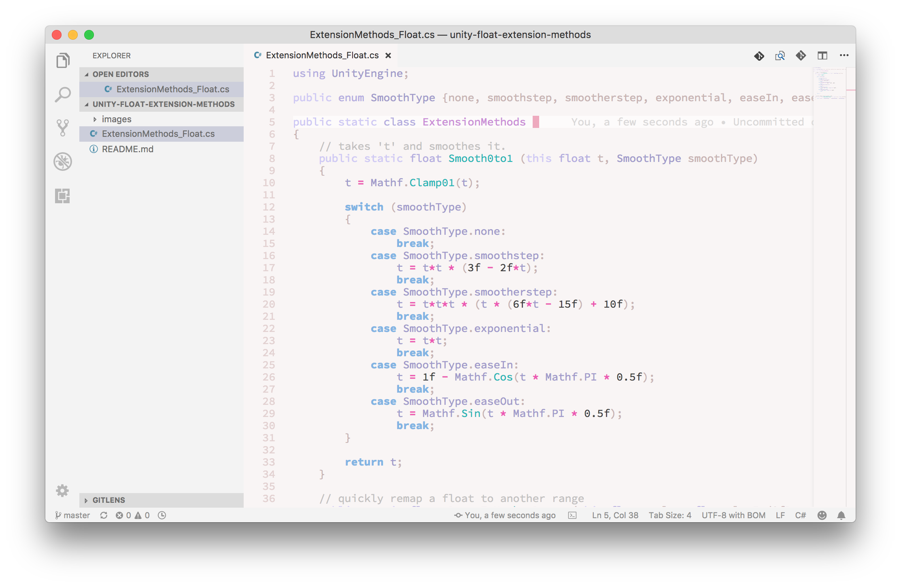

# \~ soft era \~

### syntax theme for [VS Code](https://code.visualstudio.com/)

🌸 Light pastel syntax theme for soft, warm, cozy, cute coding. 🌱

~.~
 &nbsp;&nbsp;a soft, warm, low contrast theme,
 &nbsp;&nbsp;with pastel accents that are easy on your eyes

^.^
 &nbsp;&nbsp;make stuff and learn.
 &nbsp;&nbsp;make the world your kinda place.
 &nbsp;&nbsp;take care of the people around you

🌿

---

## Installation

- Currently in alpha state and not released. you will have to download this floder and add it under `/Users/USERNAME/.vscode/extensions/` (on mac)

💾 enjoy <3

---

## Contributing

### TODO:
- [ ] full pass on logic behind the coloring of various elements
- [ ] full pass on scoped definitions — probably start working over the code from a theme like [Dracula](https://github.com/dracula/visual-studio-code) that applies of a lot of nice variations to type (italics etc) at various scopes.
- [ ] apply theme colors to the integrated terminal

---

Happy to hear any input <3

💖 [@animalphase](https://twitter.com/animalphase) on twitter
